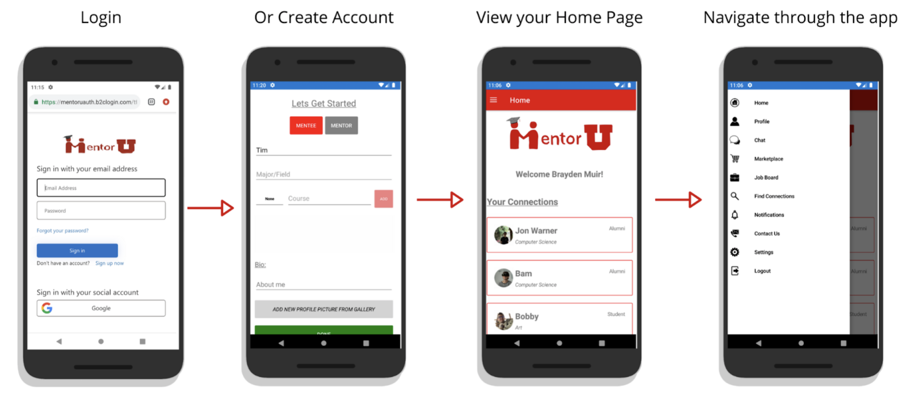
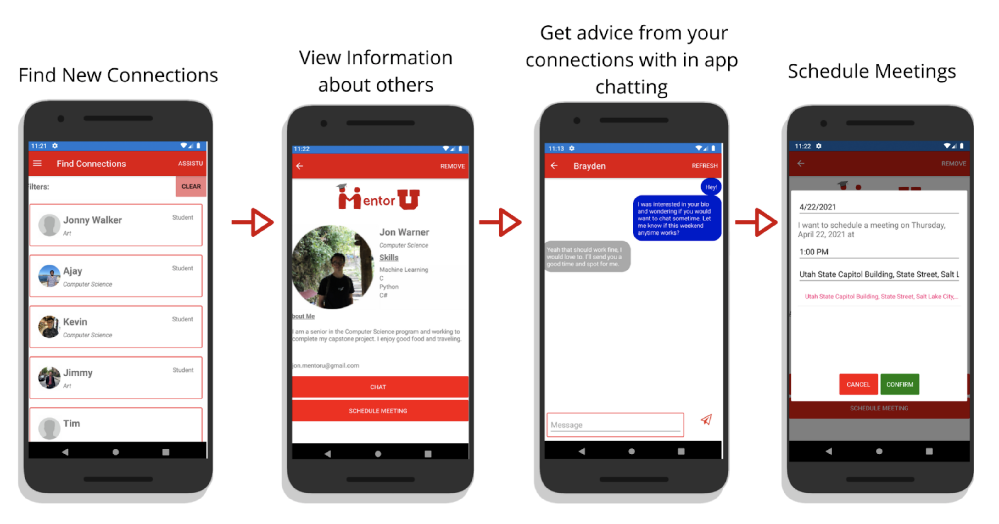
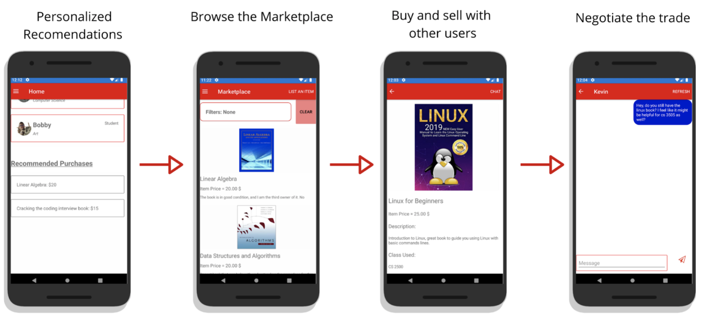

# Tutorial

### Welcome to the tutorial for our application!
 

  
   
  You can sign up for a MentorU account using Google account. From there, you can enter your information, and select your role as a mentor or a mentee, enter your classes/skills, bio, your name. After you complete this step, it will redirect you to the homepage, where you can start using our app.
  

 

  
   
  On the top left, there is a flyout button where you go to different sections of the app. You can find a new connection, by selecting "Find Connections" tab, and from there you can filter or select whom you would like to connect with.
  
  Clicking on the connection will redirect you to view the user's profile and from there, you can either chat with the user or set up a meeting.
  

  
   
  You can view recommended items from the marketplace on the home page. You can also access the marketplace via the flyout menu. You can browse the marketplace and use filters to make it easier to search. Clicking on the item will bring up more information about the item. Then you can chat with the seller to begin negotiating. 

